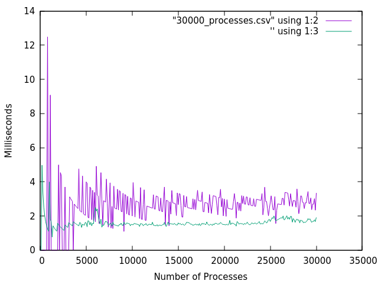

# Exercises for Chapter 12

**1. Write a function `start(AnAtom, Fun)` to register `AnAtom` as `spawn(Fun)`. Make sure the program works correctly in the case when two parallel processes simultaneously evalutate `start/2`. In this case ensure one process fails and the other succeeds.**

In `exercise_1/` there is a module named `spawn_registered_fun` that contains a `start/2` function.

Example usage:

```
erlc spawn_registered_fun.erl
erl
1> spawn_registered_fun:start(foo, fun() -> receive _ -> ok end end).
{ok,<0.40.0>}
2> spawn_registered_fun:start(foo, fun() -> receive _ -> ok end end).
{error,already_running}
```

**2. Measure process spawning time on your machine. Use the program in Section 12.3 on page 189. Plot a graph of the number of process compared with process creation time. What can you deduce from the graph?**

In `exercise_2/` there is a file named `processes_graph.erl`. This Erlang file will spawn processes and time the takes to spawn them. The module the file defines contains two public functions.  `spawn_and_time/1` spawns N number of processes and returns the average time it took to spawn them. `generate_data/3` calls `spawn_and_time/1` with a different number until a certain number of proceses are created, and writes the resulting averages to a CSV file.

Example usage:

```
erlc processes_graph.erl
erl
% Generate file for averages up 10,000 processes
1> processes_graph:generate_data("10000_processes.csv", 10000, 100).
% Generate file for averages up 30,000 processes
2> processes_graph:generate_data("30000_processes.csv", 30000, 100).
```

Graph the data in the CSVs can be done with the gnuplot files I have already created:

```
$ gnuplot -p spawn_times_10000.gnuplot
# generates graph of average runtimes for up to 10,000 processes
$ gnuplot -p spawn_times_30000.gnuplot
# generates graph of average runtimes for up to 30,000 processes
```

The graphs should look something like the one below



Looking at these graphs it is clear that the average spawn time for a single process is constant. Whether there is 1 process running or 10,000, spawning a new proceses takes about the same amount of time.
